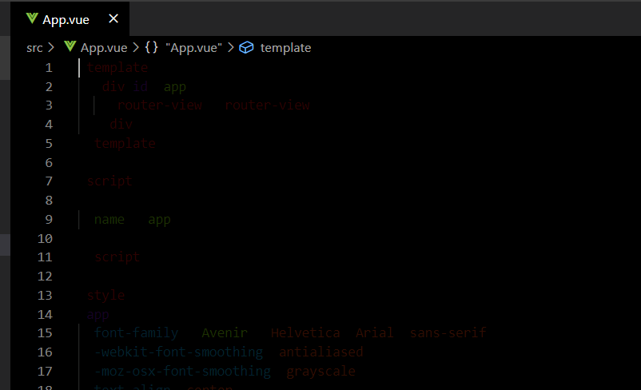

# Stealth Mode Theme
## Keep your code safe from spies. Get Stealthy and and code safe.
The stealth mode theme is inspired to let you program away during times when you're in danger of exposure. With slight tuning to the text colours, you can still edit and view your code but it is less prone to be noticeable from someone glancing at your screen.

- With love, from Osman Warsi.

## Installation
1. Open the extensions sidebar on Visual Studio Code
2. Search for `Stealth Mode Theme`
3. Click Install
4. Click Reload (to reload your editor)
5. Select the Manager Cog (bottom left) > Color Theme > Stealth Mode Theme
6. Stealth-code away! 

## Screenshot

### Issues & Suggestions
For any issues, use our [Github issues](https://github.com/osmanvee/Stealth-Mode-VSCode/issues)
* Portfolio for feedback: [Osman Warsi](https://www.osman-warsi.com)

**Enjoy!**
